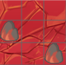

# Creating Map

The map `(.json)` must be stored in `Data/Maps`. The name of the card must be `MAP-[ID map]`. For example: `MAP-1`

In the `Data/Events` folter, create a folder with the same map name and store you events `(.json)` inside.

A scene is a set of tiles located in the `Graphics/Tilesets` folder. A map has a tileset and several autotiles (in `Graphics/Autotiles`). A map can have maximum `64` autotiles. Identifiers reserved for autotiles are from `0` to `3071`
. Each autotile is divided into 48 possible combinations.

Thus, the first identifier present on your tileset is `3072`.

Example :

The beginning of the JSON is

    {
        "map": [
                  [
                    [
                        "3072",
                        null,
                        null
                    ],
                    [
                        "3072",
                        null,
                        null
                    ],
                    [
                        "6270",
                        null,
                        null
                    ],
                    ...
                 
      
The property `map` is a three-dimensional array :

1. Position X
2. Position Y
3. Layer

`3072` represents the first tile of the lower layer

## Declare the map

In `Data/Database.json`, you have this :

    "autotiles": {
            "1": {
                "propreties": [
                    [
                        0,
                        0
                    ],
                  
                ],
                "autotiles": [
                    "2"
                ]
            }
        },
    
    "tilesets": {
            "1": {
                "propreties": [
                    [
                        5,
                        0
                    ],
                    [
                        5,
                        0
                    ],
                    ...
                 
                ],
                "graphic": "1"
            }
        },
    
     "map_infos": {
            "1": {
                "tileset_id": 1,
                "autotiles_id": 1
            }
      }

- autotiles : List sets autotiles
    - propreties : Array properties of each autotile
        - First Element : superposition
        - Second Element : practicability. `15` means that the tile is passable

            > 15 is hex value and indicates that the 4-way (or 4 bits) are 1.

    - autotiles : Array containing the resource identifier in `Data/Materials`

   
- tilesets : 
     - propreties : Such as autotiles. Array for each tile
     - graphic : Resource identifier in `Data/Materials`

- maps_infos : Map information
    - tileset_id : Tileset ID in database of properties above
    - autotiles_id : Autotiles ID in database of properties above

# Start

In `Data/Database.json` :

     "system": {
        "start": {"x": 10, "y": 2, "id": 1}
     }

- x : Position X
- y : Position Y
- id : Map ID

# Without .json file

You can set the database header : 

        RPGJS.Materials = {
			"characters": {
				"1": "event1.png"
			},
			"tilesets": {
				"1": "tileset.png"
			}
		};
	
		RPGJS.Database = {
			"actors": {
				"1": {
					"graphic": "1"
				}
			},
			"tilesets": {
				"1": {
					"graphic": "1"
				}
			},
			"map_infos": {		
				"1": {
					"tileset_id": "1"
				}
			}
		};
	
		RPGJS.defines({
			canvas: "canvas",
			autoload: false
		}).ready(function() {

            // You can define the properties of the map.  If not, RPGJS will look for map data in .json file
           // RPGJS.setMap(1, "[[[3072,null, null],[3072,null,null], ...");
		
			RPGJS.Player.init({
				actor: 1,
				start: {x: 5, y: 5, id: 1}
			});
			
			RPGJS.Scene.map();
		});

