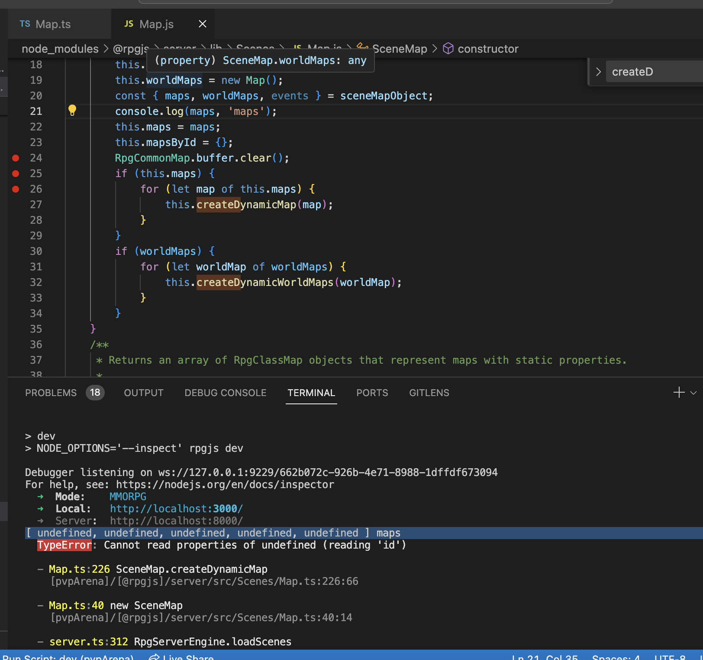

# Troubleshooting

## Cannot read properties of undefined (reading 'id')

If on server start you get Cannot read properties of undefined (reading 'id') its highly possible that you put something what was tried to be loaded by autoload and you break recommended structure 

For instance if you put smth into main/database/common/smth-common.ts what does not have decorator related to DB. 
Put your services and helpers outside of structure ie. main/helpers

## console log source of rpgjs

In command line we can see some error on server start. 

In this example we have Cannot read properties of undefined (reading 'id'), and stack trace says its in [@rpgjs]/server/src/Scenes/Map.ts:226:38

We cannot leave console.log in Map.ts, bacouse we would have to rebuild library. But we can do this in complied js in same place 
[@rpgjs]/server/lib/Scenes/Map.ts

