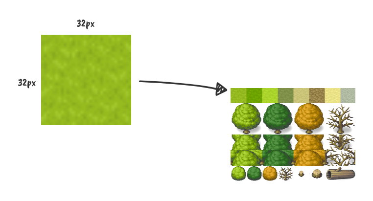
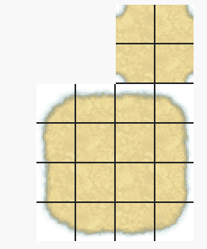
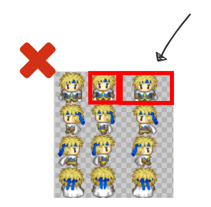
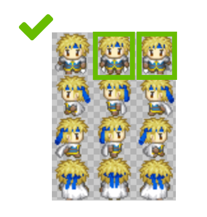

# TileMap

Une tilemap (littéralement une "carte de tuile" ou "carte de carreaux") est une grille utilisée pour créer la disposition/le fond graphique d'un jeu. Il y a plusieurs avantages à utiliser le nœud TileMap pour concevoir vos niveaux. Cela rend possible de dessiner le layout(disposition) en "peignant" les tuiles sur la grille, ce qui est beaucoup plus rapide que de placer individuellement chacune des tuiles sous formes de nœuds Sprite un par un.

# Tileset

Un tileset est un ensemble de carreaux, qui permettra de créer une carte (mapping).

1) Choisissez la taille du carreau. Ici, nous avons 32*32px

2) Il y a pas d'importance sur la largeur et hauteur de l'image, mais la bonne pratique est d'avoir une largeur plus petite (par exemple, afficher 8 carreaux sur une ligne) et d'avoir une hauteur plus grande (par exemple, 100 carreaux). ça permet de manier le tileset plus facilement dans les éditeurs de cartes
3) L'image ne doit pas dépasser 4096*4096px
4) La taille du carreau doit être un multiple de la taille de l'image. Par exemple, si la largeur est de 32px, le tileset ne doit pas faire 250px mais 256px (8 carreaux de 32px)
5) Il est possible d'avoir plusieurs tilesets sur une carte. Si vous pensez utiliser la plupart des carreaux, privilégiez, tout de même, un grand tileset que plusieurs tilesets.

> Ce n'est pas une obligation d'avoir un carré mais c'est recommandé (plus simple pour le mapping)

Ensuite, ce carreau est utilisé pour être dessiné sur la carte

# Autotiles

Les Autotiles vous permettent de définir un groupe de tuiles, puis d'ajouter des règles pour contrôler quelle tuile est utilisée pour le dessin en fonction du contenu des cellules adjacentes

## Autotile de bords

Un autotile est un petit tileset qui affichera des carreaux selon des règles précises. Ici, c'est la génération des bords d'un carreau

Les bords sont définis de la forme suivante:

# Un Spritesheet

Un sprite est un élément graphique dans le jeu. Il représente un joueur, un personnage non joueur, un coffre, etc. Souvent, ce sprite possède des animations de déplacement ou d'actions. Pour réaliser les animations, on utilise un Spritesheet (un ensemble de Sprites)

1) Généralement, la largeur du sprite est la même que la largeur d'un carreau, et la hauteur est la hauteur d'un carreau (ou la hauteur d'un carreau * 1,5)
2) Chaque bande du spritesheet représente une action, par exemple, l'animation de déplacement
3) Si vous avez plusieurs autres personnages, utilisez la même logique (les mêmes bandes d'animations)
4) Important: la largeur et hauteur d'un sprite doit être identique aux autres sprites dans l'animation.

5) Si vous avez d'autres actions que le déplacement, mettez le dans la même image. Exemple

