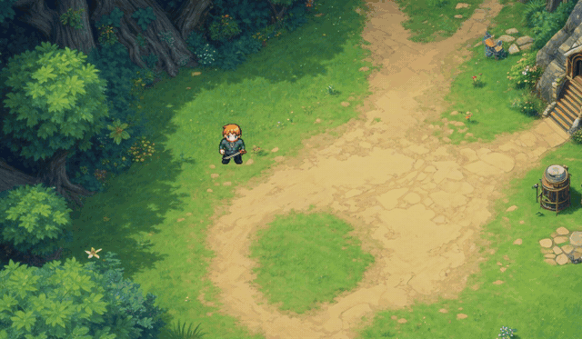
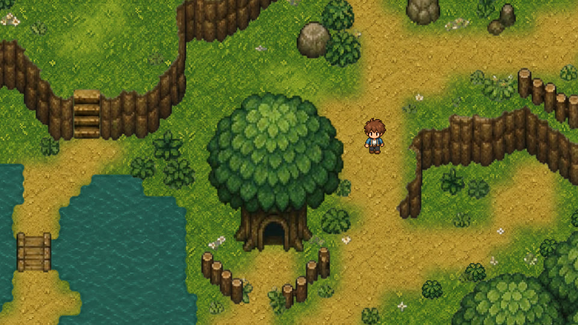
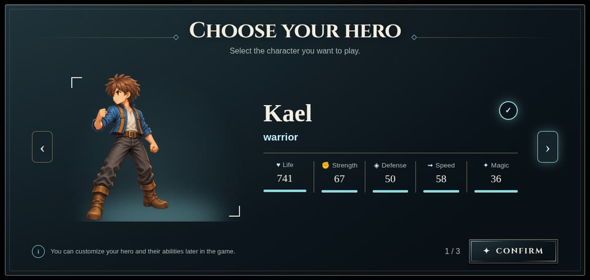

<p align="center">
  <b>Build the RPG you always wanted to make — then put it online as an MMORPG, with the same code.</b>
</p>

<p align="center">
  <a href="https://www.npmjs.com/package/@rpgjs/server"></a>
  <a href="https://www.npmjs.com/package/@rpgjs/server"></a>
  <a href="https://github.com/RSamaium/RPG-JS/blob/v5/LICENSE"></a>
  <a href="https://github.com/RSamaium/RPG-JS/stargazers"></a>
  <a href="https://discord.com/invite/W38yDyGfwC"></a>
  <a href="https://x.com/rpgjs_dev"></a>
</p>

<p align="center">
  <a href="https://v5.rpgjs.dev/guide/quick-start"><b>Quick start</b></a> ·
  <a href="https://v5.rpgjs.dev">Documentation</a> ·
  <a href="https://youtu.be/JYzx0JG_cts">Watch the intro</a> ·
  <a href="https://discord.com/invite/W38yDyGfwC">Discord</a>
</p>

<p align="center">
  
</p>

RPGJS is a TypeScript framework for 2D RPGs and MMORPGs in the browser. Maps,
events, dialogs, inventory, skills, combat, save/load, GUI and multiplayer
synchronization are already there — you write the game, not the engine.

## 🎬 See it in action

<table>
<tr>
<td width="50%"><a href="https://youtu.be/JYzx0JG_cts"></a></td>
<td width="50%"><a href="https://youtu.be/FxKeLzf4yLM"></a></td>
</tr>
<tr>
<td align="center"><b>RPGJS explained</b><br>Build an RPG once, run it as an MMORPG</td>
<td align="center"><b>Getting started tutorial</b><br>From an empty folder to a multiplayer RPG in 5 steps</td>
</tr>
</table>

## 🚀 Your first game in 30 seconds

```bash
npx degit rpgjs/starter#v5 my-rpg-game
cd my-rpg-game
npm install
npm run dev
```

```txt
  VITE v8.0.16  ready in 654 ms

  ➜  Local:   http://localhost:5173/

  RPGJS v5.0.0  RPG

  ➜  Game:    ./src/standalone.ts
  ➜  Server:  runs in the browser (standalone)
```

Open the link: your hero is already walking around a map. Prefer to follow
along? Watch the [5-step getting started tutorial](https://youtu.be/FxKeLzf4yLM).

## 🌐 One codebase, two games

The gameplay you write runs on a server-owned model from day one. Switching
from a single-player RPG to an MMORPG is a runtime choice, not a rewrite.

<table>
<tr>
<th>Standalone RPG</th>
<th>MMORPG</th>
</tr>
<tr>
<td>

```ts
startGame({
  ...config,
  providers: [provideRpg(startServer)],
});
```

```bash
npm run dev
```

</td>
<td>

```ts
startGame({
  ...config,
  providers: [provideMmorpg({})],
});
```

```bash
RPG_TYPE=mmorpg npm run dev
```

</td>
</tr>
</table>

In MMORPG mode the server stays authoritative, each map becomes a synchronized
room, and the client predicts movement so the game still feels instant.

## ✨ Gameplay reads like a script

```ts
import { type EventDefinition, type RpgPlayer } from "@rpgjs/server";

export function Merchant(): EventDefinition {
  return {
    name: "Merchant",
    onInit() {
      this.setGraphic("merchant");
    },
    async onAction(player: RpgPlayer) {
      const choice = await player.showChoices("Need something for the road?", [
        { text: "A potion (20 gold)", value: "potion" },
        { text: "Just looking", value: "no" },
      ]);

      if (choice?.value === "potion" && player.gold >= 20) {
        player.gold -= 20;
        player.addItem("potion");
        await player.showText("Safe travels!");
      }
    },
  };
}
```

Want enemies that fight back? Give an event a battle AI:

```ts
new BattleAi(this, { enemyType: EnemyType.Aggressive });
```

## 🎨 Beautiful by default

<table>
<tr>
<td width="50%"></td>
<td width="50%"></td>
</tr>
<tr>
<td align="center">Maps painted in <a href="https://v5.rpgjs.dev/studio/index">RPGJS Studio</a> or <a href="https://v5.rpgjs.dev/tiled/">Tiled</a></td>
<td align="center">Prebuilt, themeable game screens</td>
</tr>
</table>

## 🧰 What's in the box

| | |
|---|---|
| 🗺️ **World** | Maps, world maps, Tiled support, events, shared and per-player scenarios, weather, lighting, day/night |
| ⚔️ **Gameplay** | Items, skills, states, classes, real-time [action battle](https://v5.rpgjs.dev/guide/battle-ai), projectiles, hotbar, save/load |
| 🌐 **Multiplayer** | Authoritative server, map rooms, client prediction and reconciliation, live map updates, [accounts](https://v5.rpgjs.dev/gui/account), [chat](https://v5.rpgjs.dev/gui/chat) |
| 🖼️ **Interface** | Title screen, dialogs, menus, shop, HUD, character select, [themes](https://v5.rpgjs.dev/gui/theming), mobile controls, gamepad, Vue overlays |
| 🌍 **i18n** | One translation catalog for server dialogs, client menus and modules |
| 🛠️ **Tooling** | TypeScript first, Vite, Vitest testing helpers, dependency injection, modules and plugins |
| ☁️ **Deploy** | [Node or Cloudflare Workers](https://v5.rpgjs.dev/guide/deploy-mmorpg), with no lock-in to a database or host |

## 🤖 Build it with your AI assistant

Teach your coding assistant how RPGJS v5 works:

```bash
npx skills add https://github.com/RSamaium/RPG-JS#v5
```

## 📚 Learn

1. [Quick start](https://v5.rpgjs.dev/guide/quick-start) and [project structure](https://v5.rpgjs.dev/guide/structure)
2. [Create your first map](https://v5.rpgjs.dev/guide/create-your-first-map) and [an event](https://v5.rpgjs.dev/guide/create-event)
3. [Design your GUI](https://v5.rpgjs.dev/gui/)
4. [Save and load](https://v5.rpgjs.dev/guide/save-load), [translate your game](https://v5.rpgjs.dev/guide/i18n)
5. [Put your MMORPG online](https://v5.rpgjs.dev/guide/deploy-mmorpg)

Want the ideas behind the architecture? Read the [RPGJS philosophy](./docs/philosophy.md).

**Coming from RPGJS v4?** `compatibilityV4Plugin()` from `@rpgjs/vite` runs a
v4 project layout on the v5 runtime. See the
[migration guide](https://v5.rpgjs.dev/guide/v4-compatibility).

## 💬 Community

- Questions, ideas and showcases: [Discord](https://discord.com/invite/W38yDyGfwC)
- News and updates: [@rpgjs_dev on X](https://x.com/rpgjs_dev)
- Bugs: [GitHub Issues](https://github.com/RSamaium/RPG-JS/issues)
- Want to contribute? Start with [CONTRIBUTING.md](./CONTRIBUTING.md)

If RPGJS helps you build your game, a ⭐ on GitHub helps others find it.

## License

MIT — free for commercial use.
